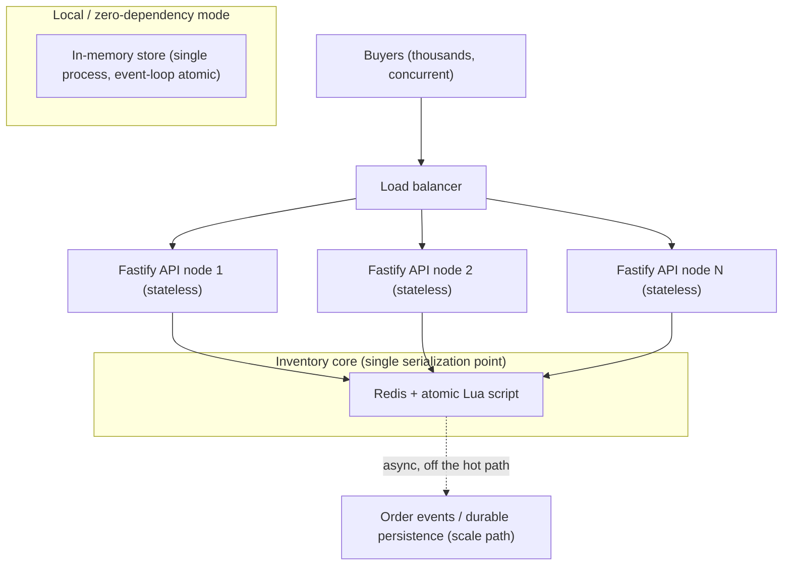

# Flash Sale System

[](https://github.com/clrke/flash-sale-system/actions/workflows/ci.yml)

A high-throughput flash sale platform for a single, limited-stock product. It is built to absorb a sudden surge of concurrent buyers while guaranteeing two invariants under any load:

1. **No overselling** - the number of units sold never exceeds the stock, not even by one.
2. **One item per user** - each user secures at most one unit.

The whole design is organised around making those two invariants impossible to violate, rather than merely unlikely.

## Contents

- [Architecture](#architecture)
- [Why this design](#why-this-design-key-decisions-and-trade-offs)
- [Project structure](#project-structure)
- [Getting started](#getting-started)
- [Configuration](#configuration)
- [API reference](#api-reference)
- [Testing](#testing)
- [Stress test: how to run and what to expect](#stress-test-how-to-run-and-what-to-expect)
- [Scaling and production notes](#scaling-and-production-notes)
- [Deliberate simplifications](#deliberate-simplifications)

## Architecture



The API tier is **stateless and horizontally scalable**. All correctness-critical state (remaining stock, the set of users who already bought) lives behind an `InventoryStore` interface with a single, atomic `attemptPurchase` operation. Two adapters implement that interface:

- **`RedisInventoryStore`** (production answer): the decision runs as one Redis Lua script. Redis executes each script atomically on its single-threaded core, so no matter how many API nodes call it concurrently, the check-and-decrement is serialized. This is the horizontally scalable source of truth.
- **`InMemoryInventoryStore`** (zero-dependency answer): relies on Node's single-threaded event loop. The critical section contains no `await`, so the event loop cannot interleave two purchases. It needs no Docker or Redis, which lets a reviewer run and stress the entire system with `npm install` + `npm test`.

Both adapters pass the exact same test contract, including the heavy concurrency and no-oversell cases.

## Why this design: key decisions and trade-offs

**1. The atomic inventory operation is the whole game.**
A naive `if (stock > 0) stock--` split across a read and a write is a classic race: thousands of requests read `stock = 1` before any of them writes, and they all "succeed". Overselling follows. The fix is to make "check user has not bought -> check stock > 0 -> decrement stock -> record the user" a **single atomic step**. The Lua script (`src/inventory/purchaseScript.ts`) does exactly that, and it also folds in the one-per-user check so both invariants are enforced in the same atomic op.

**2. Redis as the serialization point, not a database transaction.**
A relational DB with `SELECT ... FOR UPDATE` or a conditional `UPDATE ... WHERE stock > 0` would also be correct, but a single hot row becomes the bottleneck under a flash-sale spike, and connection pools saturate. Redis holds the counter in memory, executes the decision in microseconds, and its single-threaded model gives us serialization for free. It is the right tool for a short, extremely hot, in-memory counter.

**3. Stateless API tier.**
The Fastify nodes hold no inventory state, so we can run as many as the load needs behind a load balancer. They are pure request translators: parse -> call service -> map outcome to HTTP. This is what makes the system scale out rather than up.

**4. Two adapters behind one interface.**
Coding to `InventoryStore` keeps the business logic decoupled from the storage engine, gives reviewers a frictionless zero-dependency run, and demonstrates that the concurrency guarantee is a property of the design (atomic critical section) rather than an accident of one backend.

**5. Sale-window policy lives above the atomic core.**
`FlashSaleService` owns the configurable start/end window, input validation, and outcome shaping. The window check is intentionally outside the atomic op because it is coarse-grained time policy; the invariants that actually need atomicity (no oversell, one-per-user) stay inside `store.attemptPurchase`. This keeps the hot path minimal.

**6. HTTP status mapping.**
`success` and `already_purchased` return `200` (the user holds a unit). `sold_out`, `not_started`, and `ended` return `409 Conflict` (a valid request that cannot be satisfied now). A missing user id returns `400`. The JSON body always carries a machine-readable `status` so the UI can render precise feedback.

## Project structure

```
flash-sale-system/
├── package.json                 # npm workspaces root
├── tsconfig.base.json
├── docker-compose.yml           # optional Redis for the STORE=redis path
├── .env.example
├── packages/
│   ├── backend/
│   │   ├── src/
│   │   │   ├── inventory/
│   │   │   │   ├── types.ts                  # InventoryStore interface + outcomes
│   │   │   │   ├── InMemoryInventoryStore.ts # event-loop-atomic adapter
│   │   │   │   ├── RedisInventoryStore.ts     # Redis + Lua adapter
│   │   │   │   └── purchaseScript.ts          # the atomic Lua script
│   │   │   ├── service/FlashSaleService.ts    # sale window + validation + policy
│   │   │   ├── server.ts                      # Fastify app factory (stateless)
│   │   │   ├── config.ts                      # env -> config, store factory
│   │   │   ├── index.ts                       # entrypoint
│   │   │   └── stress/run-stress.ts           # standalone HTTP stress harness
│   │   └── test/
│   │       ├── contract.ts                    # shared InventoryStore contract
│   │       ├── inventory.test.ts              # in-memory unit + concurrency
│   │       ├── redis.test.ts                  # same contract vs Redis (opt-in)
│   │       ├── service.test.ts                # sale-window unit tests
│   │       ├── api.test.ts                    # HTTP integration (fastify.inject)
│   │       └── stress.test.ts                 # no-oversell under a herd
│   └── frontend/                # React + Vite UI
```

## Getting started

**Prerequisites:** Node.js 18+ and npm 9+. Docker is optional (only for the Redis path).

```bash
# 1. Install all workspace dependencies
npm install

# 2. Run the backend (in-memory store, zero dependencies)
npm run dev
# -> Flash sale backend ready on http://localhost:3000

# 3. In a second terminal, run the frontend
npm run dev:web
# -> Vite dev server, proxies /api to http://localhost:3000
```

By default the sale starts immediately and runs for 3 minutes with 5 units of stock, so you can buy right away and see the full lifecycle (live to sold out or ended) without waiting. See [Configuration](#configuration) to change stock, window, or store.

To exercise the Redis-backed path:

```bash
docker compose up -d redis
STORE=redis REDIS_URL=redis://localhost:6379 npm run dev
```

### Run the whole stack with Docker

One command builds the backend and frontend images and runs them against Redis (the atomic-Lua path) with AOF persistence:

```bash
docker compose up --build
# -> open http://localhost:8080
```

The backend runs as a non-root user with a `/health` liveness check; nginx serves the built frontend and reverse-proxies `/api` to the backend. This mirrors the production topology in [docs/DEPLOYMENT.md](docs/DEPLOYMENT.md).

### Continuous integration

`.github/workflows/ci.yml` runs on every push and pull request: typecheck, unit and integration tests, a build, the same store contract against a real Redis service, and the stress harness (which fails the build if the system ever oversells).

### Deployment

[docs/DEPLOYMENT.md](docs/DEPLOYMENT.md) maps this design onto a production AWS topology (CloudFront and S3, ECS Fargate behind an ALB, ElastiCache for Redis, and an SQS plus Lambda path for durable orders), with scaling, fault-tolerance, CI/CD, and observability notes.

## Configuration

All settings are environment variables with sensible defaults (see `.env.example`). Copy it to `.env` or export inline.

| Variable           | Default                  | Description                                                  |
| ------------------ | ------------------------ | ------------------------------------------------------------ |
| `PORT`             | `3000`                   | HTTP port                                                    |
| `HOST`             | `0.0.0.0`                | Bind address                                                 |
| `STORE`            | `memory`                 | `memory` (zero-dependency) or `redis`                        |
| `REDIS_URL`        | `redis://localhost:6379` | Redis connection (used only when `STORE=redis`)              |
| `PRODUCT_NAME`     | `Aurora Wireless Headphones` | Display name of the product on sale                      |
| `PRODUCT_TAGLINE`  | (short tagline)          | Short marketing line shown under the name                    |
| `PRODUCT_PRICE`    | `$149`                   | Display price string                                         |
| `PRODUCT_IMAGE_URL`| `/product.jpg`           | Product image; defaults to a real photo bundled with the frontend, or set any absolute URL |
| `TOTAL_STOCK`      | `5`                      | Units available for the sale                                 |
| `SALE_START`       | now                      | ISO 8601 start; if unset, the sale starts now                |
| `SALE_END`         | start + duration         | ISO 8601 end; if unset, computed from `SALE_DURATION_MS`      |
| `SALE_DURATION_MS` | `180000`                 | Sale length when `SALE_END` is not given (default 3 minutes) |
| `ENABLE_RESET_API` | `false`                  | Registers `POST /api/sale/reset` for local testing/demo (see below); off by default |

## API reference

### `GET /api/sale/status`
Returns the current sale status and inventory snapshot.

```json
{
  "status": "active",
  "product": {
    "name": "Aurora Wireless Headphones",
    "tagline": "Studio-grade sound, 40-hour battery, strictly limited drop.",
    "price": "$149",
    "imageUrl": "/product.jpg"
  },
  "totalStock": 100,
  "remainingStock": 42,
  "soldCount": 58,
  "saleStart": "2026-07-13T10:00:00.000Z",
  "saleEnd": "2026-07-13T11:00:00.000Z",
  "serverTime": "2026-07-13T10:12:00.000Z"
}
```
`status` is one of `upcoming`, `active`, `ended`.

### `POST /api/sale/purchase`
Body: `{ "userId": "alice" }`

| Outcome          | HTTP | Body                                                 |
| ---------------- | ---- | ---------------------------------------------------- |
| Purchased now    | 200  | `{ "status": "success", "secured": true }`           |
| Already had one  | 200  | `{ "status": "already_purchased", "secured": true }` |
| Stock exhausted  | 409  | `{ "status": "sold_out", "secured": false }`         |
| Sale not started | 409  | `{ "status": "not_started", "secured": false }`      |
| Sale ended       | 409  | `{ "status": "ended", "secured": false }`            |
| Missing user id  | 400  | `{ "status": "invalid_user", "secured": false }`     |

### `GET /api/sale/secured?userId=alice`
Returns whether a user already holds a unit: `{ "userId": "alice", "secured": true }`.

### `POST /api/sale/reset` (opt-in, `ENABLE_RESET_API=1`)
Testing/demo convenience: restarts the sale clock and refills stock back to `TOTAL_STOCK`, clearing every recorded buyer. Not part of the take-home brief and not wired up at all unless explicitly enabled (returns 404 otherwise) - it is unauthenticated, so leave it off for anything beyond local iteration or a live walkthrough.

Body (optional): `{ "durationMs": 180000 }` - defaults to 3 minutes if omitted. Returns the same shape as `GET /api/sale/status`, or `400` for a non-positive `durationMs`.

## Testing

```bash
npm test           # unit + integration + stress (in-memory), from repo root
```

The suite has four layers:

- **Unit / concurrency (`inventory.test.ts` via `contract.ts`)** - drives the store directly, including 2,000 concurrent unique buyers against 100 units (expect exactly 100 winners) and 200 concurrent attempts from one user (expect exactly one winner).
- **Service (`service.test.ts`)** - the sale window (`upcoming` / `active` / `ended`), validation, and id trimming, using an injected clock for determinism.
- **Integration (`api.test.ts`)** - the full Fastify pipeline via `app.inject`, covering each endpoint, status codes, and a 500-request concurrent no-oversell check.
- **Stress (`stress.test.ts`)** - 10,000 concurrent buyers vs 200 units through the HTTP layer, asserting `successful_purchases === stock` exactly.

### Verifying the Redis path (optional)
The same store contract runs against real Redis when enabled:

```bash
docker compose up -d redis
RUN_REDIS_TESTS=1 REDIS_URL=redis://localhost:6379 npm test
```

## Stress test: how to run and what to expect

A standalone harness boots a real HTTP server and fires genuinely concurrent requests over the loopback network, mixing in duplicate users to prove the one-per-user guarantee under load as well:

```bash
npm run stress
# or tune it:
USERS=20000 STOCK=500 CONCURRENCY=500 DUPLICATE_RATIO=0.1 npm run stress
# or against Redis:
STORE=redis REDIS_URL=redis://localhost:6379 npm run stress
```

**Expected outcome:** the harness exits `0` only if all invariants hold. A typical run (`USERS=10000 STOCK=200`) prints:

```
--- Results ---
{ "success": 200, "sold_out": 9600, "already_purchased": 200 }
{ "elapsedMs": ~2000, "throughputReqPerSec": ~4800, "soldCount": 200, "remainingStock": 0 }

PASS: exactly 200 units sold, no overselling, one unit per user.
```

The key line is `success === STOCK` and `remainingStock === 0`: exactly the stock is sold, never more, regardless of concurrency. If the invariant were ever violated, the harness prints the failing check and exits non-zero.

## Scaling and production notes

- **Bottleneck analysis:** with a stateless API tier, the single hot point is the inventory core. A single Redis instance comfortably serves tens of thousands of atomic ops per second, well beyond a single-product flash sale. If a product ever needed more, the counter can be sharded (split N units across K Redis keys and route by hash) to multiply throughput.
- **Durability / orders:** this exercise keeps the "who won" set in Redis. In production the winning purchase would emit an event to a durable queue (for example Kafka or SQS) and a consumer would write the order to a database off the hot path, so persistence latency never slows the sale. This is the dashed "scale path" in the diagram.
- **Fault tolerance:** API nodes are disposable; the load balancer routes around a crashed node. Redis would run with replication and AOF persistence so a failover does not lose the sold set. `ioredis` is configured to fail fast rather than buffer commands indefinitely when Redis is unreachable, so callers get a clear error instead of hanging.
- **Abuse / fairness:** a real deployment would add rate limiting and authentication in front of `attemptPurchase`; the atomic core already prevents a single authenticated user from taking more than one unit.

## Deliberate simplifications

Kept intentionally out of scope to stay focused on the core problem (correct, scalable concurrency), and called out here for transparency:

- Winners are stored in Redis / memory rather than a durable relational database. The queue-and-persist path is documented above, not implemented.
- No authentication: `userId` is trusted from the request, as the brief models identity as a plain username or email.
- No payment step: "securing a unit" is the terminal action.
- The frontend is intentionally minimal, focused on demonstrating the flow (status, buy, feedback) rather than production polish.
- `POST /api/sale/reset` is dev/demo tooling for replaying the sale lifecycle quickly, not a feature the brief asked for. It is unauthenticated, so it stays off by default (`ENABLE_RESET_API`) and would need auth (or removal) before any real deployment.
