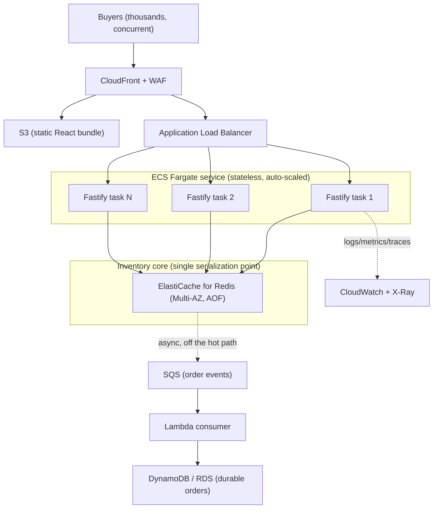

# Deployment and Infrastructure

This document describes how the flash sale system runs in three settings, from a
laptop to a production AWS account, and why the code's design makes each step
straightforward. The take-home brief did not require a live deploy, so nothing
here is provisioned. It is the operational plan that the application architecture
was built to support.

The guiding property is that **all correctness-critical state lives behind one
atomic operation in Redis, and the API tier is stateless**. That single decision
is what lets the system scale horizontally, fail over, and deploy with zero
downtime without ever risking an oversell.

## 1. Local: zero dependencies

```
npm install --include=dev
npm test        # unit + integration + an HTTP stress test
npm run stress  # 10k requests / 9k users vs 200 stock, asserts exactly 200 sold
```

No Docker and no Redis are required. The default in-memory adapter is correct on
a single process because the critical section holds no `await`, so the Node event
loop cannot interleave two purchases. This is the fastest way for a reviewer to
run and stress the whole system.

## 2. Containers: the full stack in one command

```
docker compose up --build
# open http://localhost:8080
```

Compose builds two images and wires them to Redis:

- **backend**: multi-stage build, production dependencies only, runs as a
  non-root user, exposes `/health` for liveness, and runs against the Redis
  adapter (`STORE=redis`) so the container path is the same atomic-Lua code that
  scales in production.
- **frontend**: the Vite bundle served by nginx, which reverse-proxies `/api` to
  the backend over the compose network.
- **redis**: `redis:7-alpine` with AOF persistence enabled, so the sold set
  survives a restart.

This mirrors the production topology below: a stateless API tier in front of a
single atomic inventory core.

## 3. Production: AWS

Bookipi runs on AWS, so the target maps cleanly onto managed AWS services. The
stateless API tier and the single Redis serialization point translate directly.



### Component mapping

| Concern | AWS service | Why |
| --- | --- | --- |
| Static frontend | S3 + CloudFront | Cache the bundle at the edge; the origin never serves static bytes. |
| Edge protection | CloudFront + WAF | Absorb the spike, rate-limit and block abuse before it reaches the app. |
| API tier | ECS Fargate behind an ALB | Stateless tasks scale out horizontally; no servers to manage. |
| Inventory core | ElastiCache for Redis (Multi-AZ) | In-memory atomic counter, single-threaded serialization, microsecond decisions. |
| Durable orders | SQS + Lambda + DynamoDB or RDS | Persist winners off the hot path so durability latency never slows the sale. |
| Config and secrets | SSM Parameter Store / Secrets Manager | Inject `REDIS_URL`, stock, and sale window without baking them into images. |
| Observability | CloudWatch + X-Ray | Metrics, structured logs, distributed traces, and alarms. |
| Images | ECR | Private registry for the backend and frontend images built in CI. |

### Request path

1. CloudFront serves the React bundle from S3 and forwards `/api/*` to the ALB.
2. The ALB spreads requests across Fargate tasks. Any task can serve any request
   because they hold no inventory state.
3. Each task calls the one Redis Lua script that does check-user, check-stock,
   decrement, and mark-user as a single atomic step. Redis is the serialization
   point, so the number of tasks does not affect correctness.
4. On a successful purchase the task publishes an order event to SQS and returns
   immediately. A Lambda consumer writes the durable order record, retrying on
   failure and sending poison messages to a dead-letter queue.

## 4. Scaling

- **API tier**: ECS target-tracking auto-scaling on CPU and ALB requests per
  target. Fargate adds tasks in seconds to meet a spike, and scales back to a
  small baseline afterward. This is scale-out, not scale-up.
- **Inventory core**: a single Redis primary comfortably serves tens of thousands
  of atomic ops per second, well beyond one single-product sale. If a single
  product ever needed more, the counter shards across K Redis keys (split N units
  into K buckets, route by hash) to multiply write throughput while keeping each
  bucket atomic.
- **Frontend**: served entirely from CloudFront, so buyer traffic does not touch
  the application at all for static content.

## 5. Fault tolerance and durability

- **Stateless tasks are disposable.** The ALB health check drains and replaces a
  failed task; in-flight correctness is unaffected because no state lives in the
  task.
- **Redis runs Multi-AZ with automatic failover and AOF**, so the remaining
  stock and the sold set survive an instance loss.
- **Orders are durable off the hot path.** SQS holds order events until the
  Lambda consumer commits them, with a dead-letter queue for messages that fail
  repeatedly. The sale never blocks on database latency.
- **The client fails closed.** `ioredis` is configured to fail fast rather than
  buffer commands when Redis is unreachable, so a caller receives a clear error
  instead of a hang, and a purchase is never granted that cannot be confirmed.

## 6. CI/CD

`.github/workflows/ci.yml` already runs the quality gate on every push and PR:
typecheck, tests, build, the same tests against a real Redis service, and the
stress harness that fails the build on any oversell. The deployment extension is
standard:

1. On a tagged release, build and push the backend and frontend images to ECR.
2. Register a new ECS task definition and update the service. ECS performs a
   rolling, zero-downtime deploy behind the ALB; a failed health check triggers
   an automatic rollback.
3. Sync the frontend bundle to S3 and invalidate the CloudFront cache.

Because the API tier is stateless and the inventory core is external, rolling
deploys and rollbacks carry no risk of double-selling.

## 7. Observability and security

- **Metrics**: request rate, latency percentiles, error rate, remaining stock,
  and sold count as custom CloudWatch metrics, with alarms on error rate and on
  the SQS dead-letter queue depth.
- **Tracing**: X-Ray spans across ALB, task, Redis, and SQS to locate latency.
- **Security**: WAF rate limiting at the edge, least-privilege IAM task roles,
  secrets in Secrets Manager, private subnets for Redis and the tasks, and TLS
  terminated at CloudFront and the ALB.

## 8. Pragmatism note

The compose stack and this plan intentionally stop short of provisioning real
infrastructure or writing IaC, because the brief asked for a correct, scalable
concurrency design rather than a live deploy. The architecture is deliberately
boring: managed services, one atomic core, a stateless tier. That is what makes
it cheap to run at rest, fast to scale under a spike, and safe to operate.
